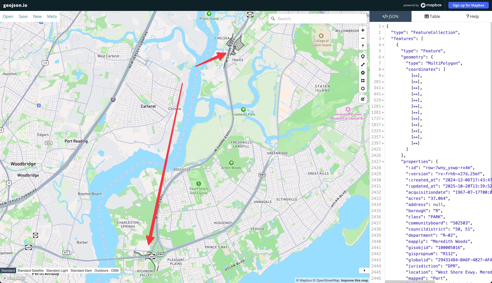
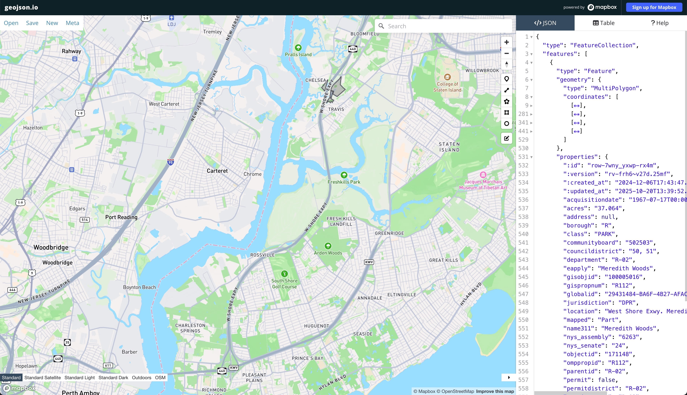

# Data

The data is sourced from [Parks Properties - NYC Open Data](https://nycopendata.socrata.com/Recreation/Parks-Properties/enfh-gkve/about_data), updated on Oct 20, 2025 and accessed on Oct 21, 2025.

## Data Description

The dataset contains metadata about NYC Parks properties and their geographic information (multipolygon).

Here's an excerpt from the dataset description:

> This dataset identifies property managed partially or solely by NYC Parks. This data has been produced in whole or part using secondary data. Data accuracy is limited by the scale and accuracy of the original sources. Site-specific conditions should be field-verified.
>
> Records are added as more land is designated under NYC Parks’ jurisdiction. Each record represents an acquisition.
>
> User Guide:
> https://docs.google.com/document/d/1NExNJF5YKID04oOopi0fHainRuGG3Pz_jKSrMujPsPk/edit?usp=sharing
>
> Dataset Link:
> https://data.cityofnewyork.us/Recreation/Parks-Properties/enfh-gkve
>
> Source: NYC Open Dat

## Data Files

This repository contains the following source data files:

- Original data file:
  - [Parks_Properties_20251021.geojson](./Parks_Properties_20251021.geojson)
- Modified individual property files:
  - [meredith_woods_modified.geojson](./meredith_woods_modified.geojson)
- Modified overall data file:
  - [Parks_Properties_20251021_modified.geojson](./Parks_Properties_20251021_modified.geojson)

## Modifications Notes

Since the goal of the project is to study the various shapes of NYC parks, it's important to have accurate data, especially across multiple polygons within a single property. The author suspected that the accuracy limitations of the original data, the data was modified in the following ways.

### "Meredith Woods" Property

For the property "Meredith Woods" (id: `row-7wny_yxwp-rx4m`, Staten Island), the original data contains 12 polygons, among which 8 are long thin strips that doesn't resemble the actual park. And 4 of the 8 thin strips are in Charleston (southwest of the SI), around 5.3 miles away from the main park.

So I deleted the 8 polygons that don't resemble the actual park. Here's the [modified geojson for "Meredith Woods" property](./meredith_woods_fixed.geojson).

