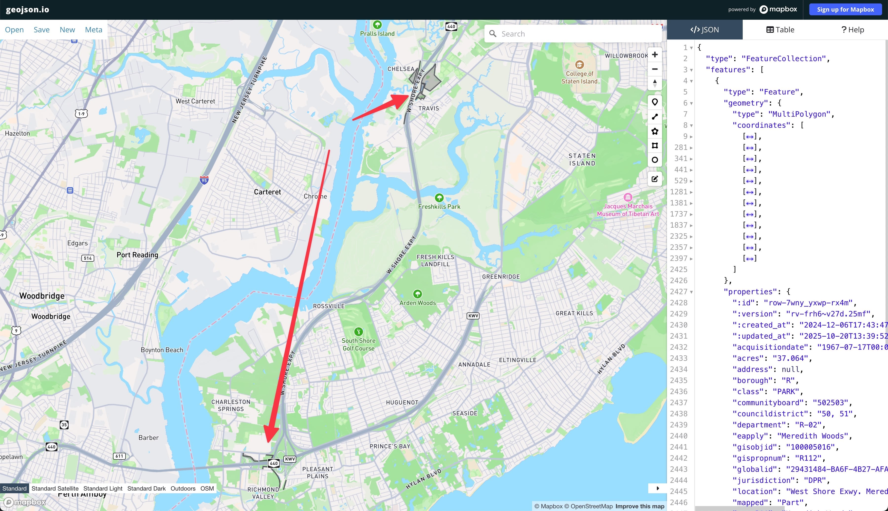
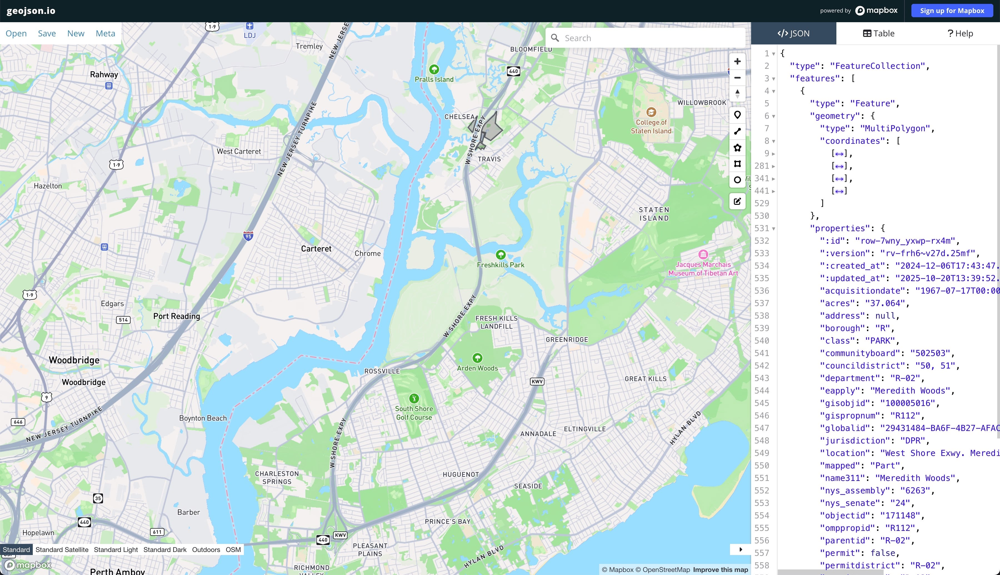
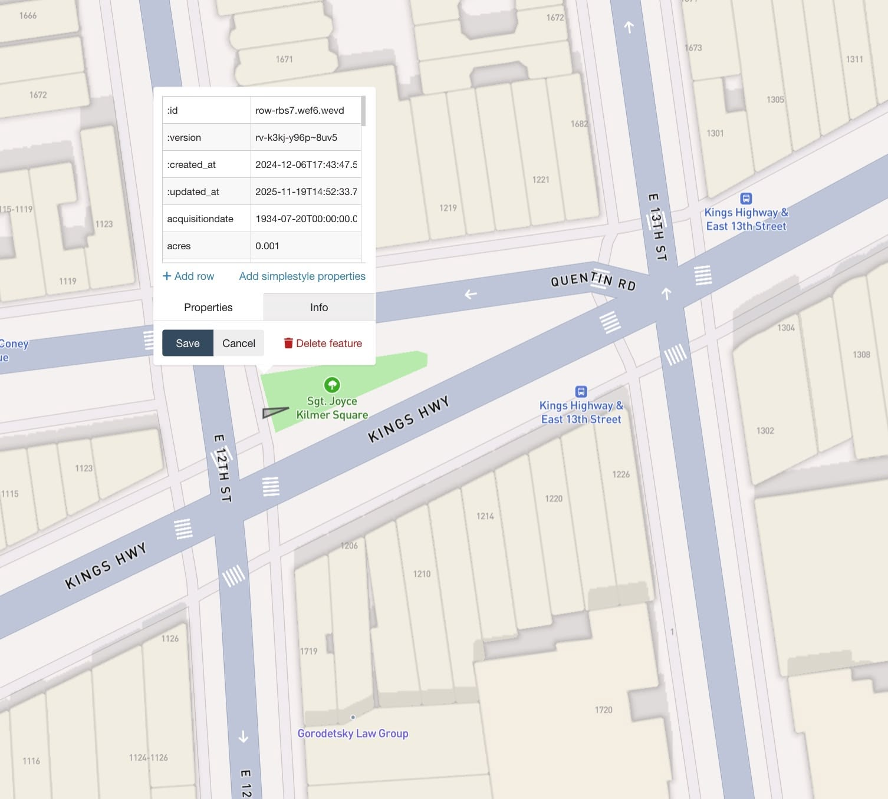
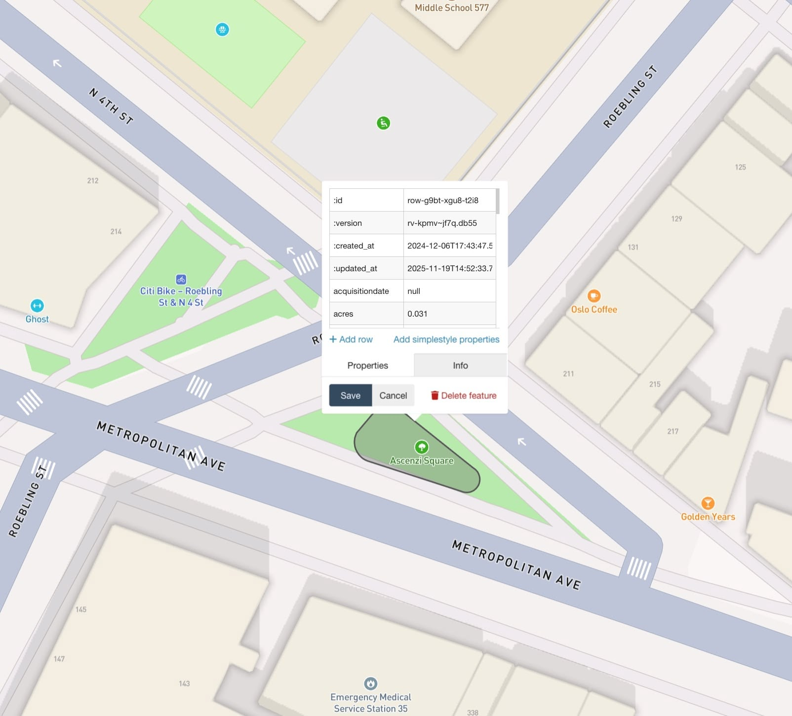
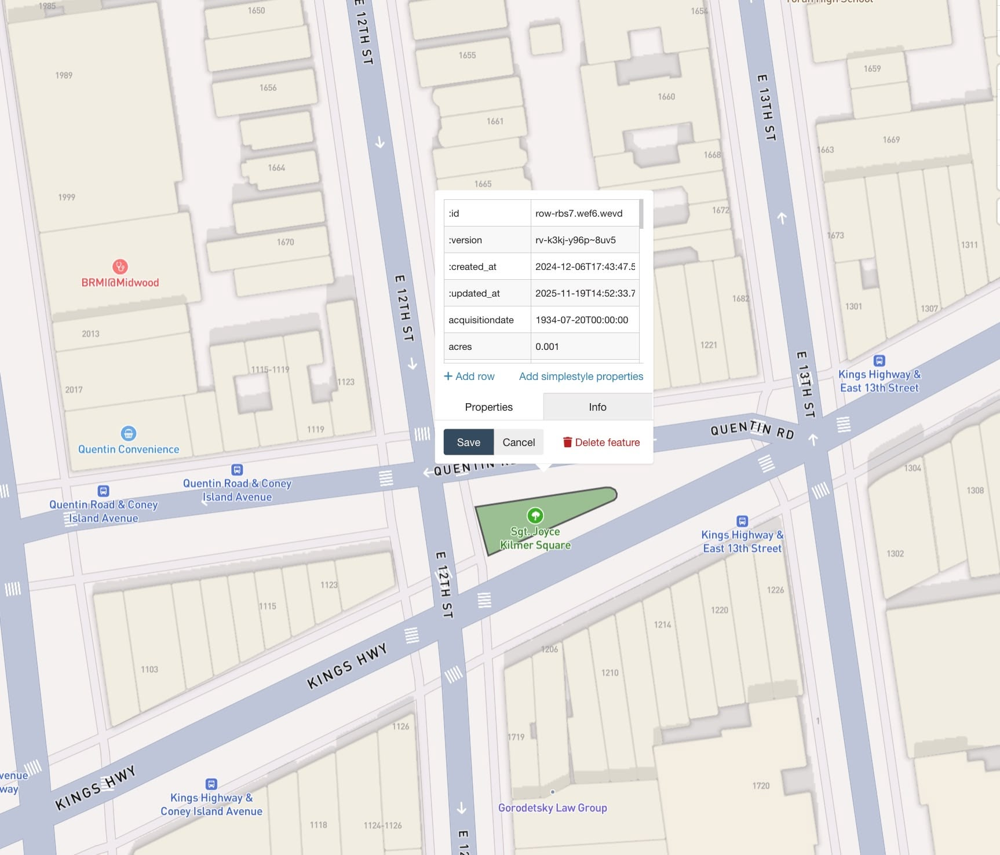
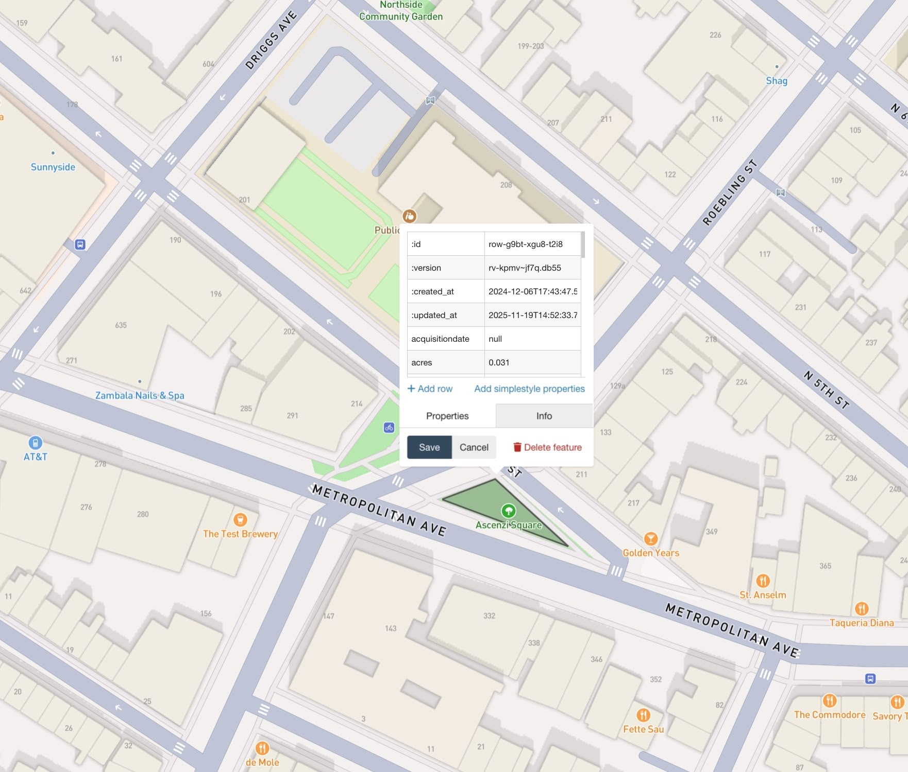

# Data

The data is sourced from [Parks Properties - NYC Open Data](https://nycopendata.socrata.com/Recreation/Parks-Properties/enfh-gkve/about_data), updated on Nov 19, 2025 and accessed on Dec 2, 2025.

## Data Description

The dataset contains metadata about NYC Parks properties and their geographic information (multipolygon).

Here's an excerpt from the dataset description:

> This dataset identifies property managed partially or solely by NYC Parks. This data has been produced in whole or part using secondary data. Data accuracy is limited by the scale and accuracy of the original sources. Site-specific conditions should be field-verified.
>
> Records are added as more land is designated under NYC Parks’ jurisdiction. Each record represents an acquisition.
>
> User Guide:
> https://docs.google.com/document/d/1NExNJF5YKID04oOopi0fHainRuGG3Pz_jKSrMujPsPk/edit?usp=sharing
>
> Dataset Link:
> https://data.cityofnewyork.us/Recreation/Parks-Properties/enfh-gkve
>
> Source: NYC Open Dat

## Data Files

This repository contains the following source data files:

- Original data file:
  - [Parks_Properties_20251119.geojson](./Parks_Properties_20251119.geojson)
- Modified individual property files:
  - [meredith_woods_modified.geojson](./meredith_woods_modified.geojson)
  - [small_parks_modified.geojson](./small_parks_modified.geojson)
    - This file is generated by the `0_fix_small_parks.py` script.
- Modified overall data file:
  - [Parks_Properties_20251119_modified.geojson](./Parks_Properties_20251119_modified.geojson)

## Modifications Notes

Since the goal of the project is to study the various shapes of NYC parks, it's important to have accurate data, especially across multiple polygons within a single property. The author suspected that the accuracy limitations of the original data, the data was modified in the following ways.

### "Meredith Woods" Property

For the property "Meredith Woods" (id: `row-7wny_yxwp-rx4m`, Staten Island), the original data contains 12 polygons, among which 8 are long thin strips that doesn't resemble the actual park. And 4 of the 8 thin strips are in Charleston (southwest of the SI), around 5.3 miles away from the main park.



So I deleted the 8 polygons that don't resemble the actual park. Here's the [modified geojson for "Meredith Woods" property](./meredith_woods_fixed.geojson).



### Specific Small Parks

Some of the polygon for the small parks are very poorly defined in a few different ways:

- The polygon is a lot smaller than the actual park.
- The polygon is missing details for curved edges.
- The polygon is misaligned with the actual park.

Here's some examples:

- 
  Sgt. Joyce Kilmer Square: This polygon is too small and not detailed enough for the east side of the park.
- 
  Ascenzi Square: This polygon also doesn't fit the actual park.

These problems mostly happen to the small parks, and I handpicked a list of parks to fix from the smallest 50 parks.

Here's a list of parks

| :id                | name311                                | location                                       |
| ------------------ | -------------------------------------- | ---------------------------------------------- |
| row-rbs7.wef6.wevd | Sgt. Joyce Kilmer Square               | E. 12 St., Kings Hwy., Quentin Rd.             |
| row-9kkg.gehr~dasq | Luke J. Lang Square                    | Fresh Pond Rd., 59 Rd. and 61 St.              |
| row-mnek_ivw9_7zuh | Middleburgh Triangle                   | Corona Ave., 90 St., 48 Ave.                   |
| row-8ttk-59ga.xbt7 | Dwyer Square                           | Northern Blvd., 34 Ave. bet. 47 St. and 48 St. |
| row-4zsg-7ji2.pm6w | Dunningham Triangle                    | 82 St., Ithaca St., Baxter Ave.                |
| row-jd95_dw66-vbrq | Corporal Frank F. Fagan Sq.            | 48 St., Newtown Rd., Broadway                  |
| row-8ni5.z4dn.nij8 | Freedom Triangle                       | Bushwick Ave., Myrtle Ave., Willoughby Ave.    |
| row-2km6.y89y~pv89 | Fowler Square                          | Fulton St., S Elliot Pl., and Lafayette Ave.   |
| row-mp7m-uyq3.tvje | Catholic War Veterans Square           | Rockaway Blvd. 116 Ave., 122 St.               |
| row-2hxt-3ruf-b3wk | O'Sullivan Plaza                       | Astoria Blvd., 25 Ave., 88 St.                 |
| row-yx4a~97r8.a7xt | Alben Square                           | 46 St., 11 Ave., New Utrecht Ave.              |
| row-nzjh~3md4-m5su | Metro Triangle                         | 125 St., 85 Ave., Metropolitan Ave.            |
| row-apz9_cx2f_g9fu | Myrtle Ave., Cypress Ave., Putnam Ave. | Myrtle Ave., Cypress Ave., Putnam Ave.         |
| row-gika_59qa~36pe | Grant Gore                             | Bedford Ave., Rodgers Ave., Bergen St.         |
| row-vd76-qn8k_asmy | Woodrow Wilson Triangle                | Soundview Ave., Underhill Ave., Patterson Ave. |
| row-5ptx.dtp6-spm9 | Horsebrook Island                      | Justice Ave., 90 St., 56 Ave.                  |
| row-tewt.g6s5.hszk | Jacob Riis Triangle                    | Bessemer St., 116 St., 85 Ave.                 |
| row-nebb~ym7k-iyx3 | Fleetwood Triangle                     | Woodhaven Blvd., 63 Dr., Penelope Ave.         |
| row-g9bt-xgu8-t2i8 | Ascenzi Square                         | Metropolitan Ave., N 4 St., and Roebling St.   |

The way I'm fixing it is to leverage OSM data through the Overpass API to get "park" elements close to the original park polygon and find the polygon with most overlap with the original park polygon as the new polygon. To be honest, I had to manually contribute to the OSM data for some obscure parks like (Jacob Riis Triangle, a tiny triangle by the Jacob Riis Playground).

To run the script to fix the parks, run the following command:

```bash
uv run source_data/0_fix_small_parks.py
```

This generates a `small_parks_modified.geojson` file in the `source_data/` directory for later merging with the original data.

The script will output the modified parks to the `small_parks_modified.geojson` file.

Here's some examples of the modified parks:

- 
  This is the modified polygon for Sgt. Joyce Kilmer Square. It's a bit off from the original polygon, but it's still a good approximation of the actual park.

- 
  This is the modified polygon for Ascenzi Square. It's a bit off from the original polygon, but it's still a good approximation of the actual park.

## Applying the modified parks to the original data

To apply the modified parks to the original data, run the following command:

```bash
uv run source_data/99_apply_mod.py
```

This will merge the `small_parks_modified.geojson` file with the original data and save the result to the `Parks_Properties_20251119_modified.geojson` file in the `source_data/` directory.
